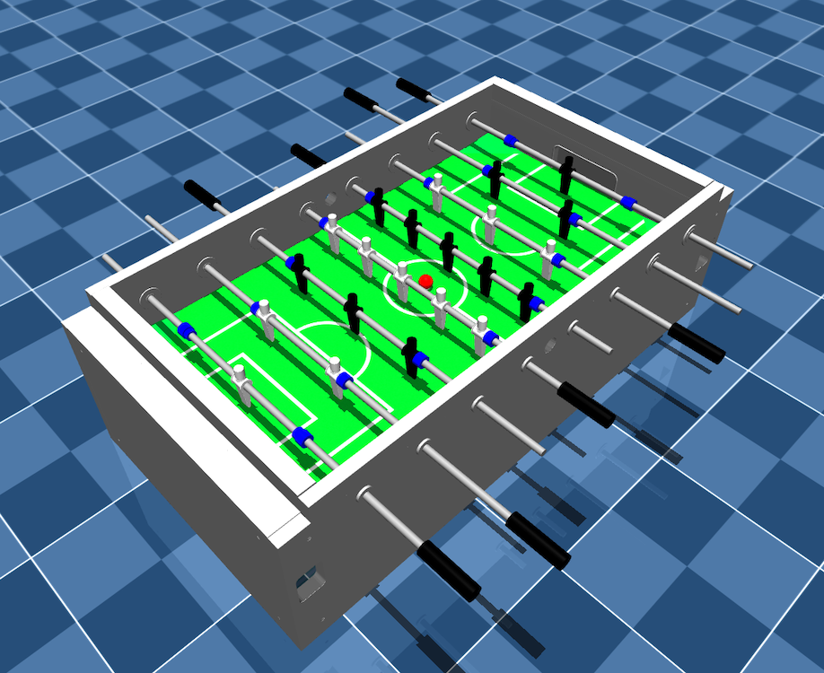
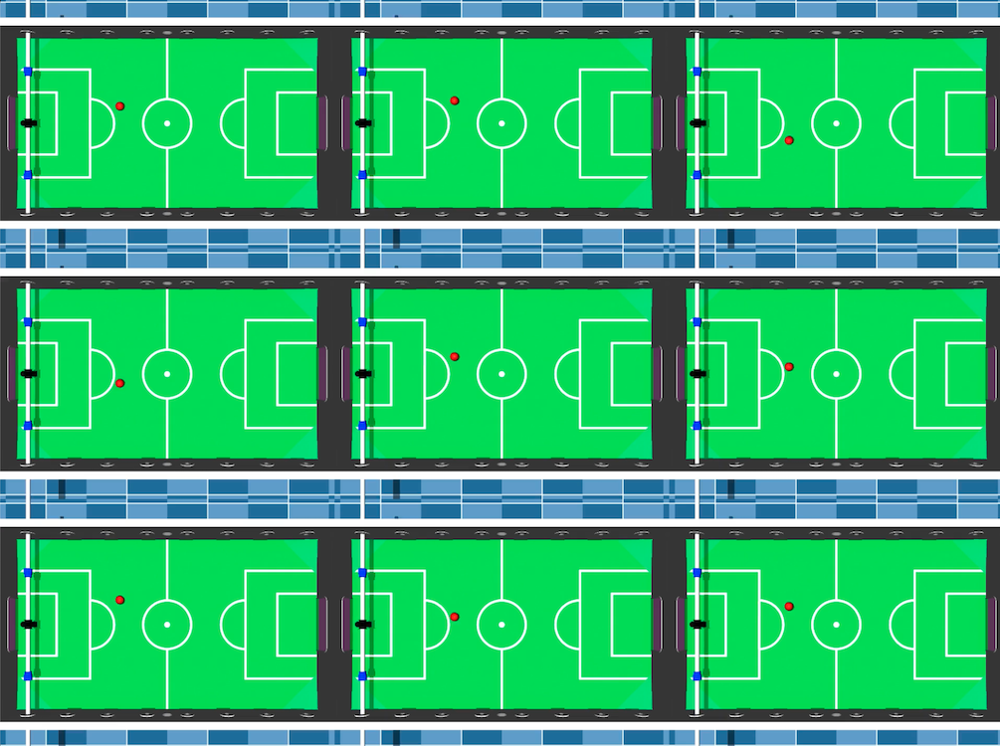
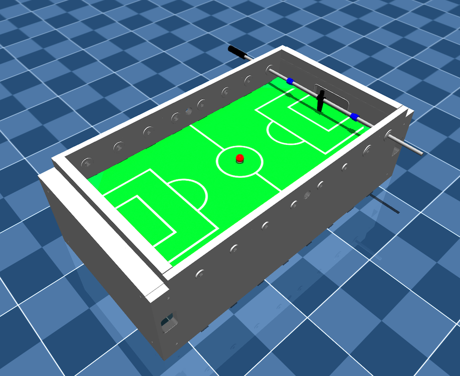

# FoosballRL
#### Train a Foosball-Agent using Deep Reinforcement Learning

This is an exercise for students to train a goalie in a foosball environment using Python.
The environment is based on a to scale mujoco model of a foosball table.
Students are encouraged to experiment with different RL-algorithms and observe their performance.
This project provides built-in support for RL-algorithms from [stable-baselines3](https://github.com/DLR-RM/stable-baselines3) and [stable-baselines3-contrib](https://github.com/Stable-Baselines-Team/stable-baselines3-contrib).
Video recording and multi-env training are also built-in. The training process can be monitored using tensorboard and watched
live using an interactive viewer. The tensorboard-results of multiple training runs are aggregated.




## Installing

Navigate to the project directory and install the required Python packages.

```bash
pip install -r requirements.txt
```

## Running the Project

The main entry point of the project is `foosball_rl/__main__.py`. This script reads the run-configuration
from `foosball_rl/run_config.yml`, and either starts training or evaluating a model.
One run will train multiple different models with the same configuration but different random-seeds, which can be set in
the `foosball_rl/run_config.yml`, and save the results in the `experiments` directory.

Before training: Make sure to set the `experiment_name` in the `foosball_rl/run_config.yml` file to a unique name for the current experiment. While nothing will be overridden if forgotten, a new directory with an added timestamp will be created for each run.

Don't forget to source your venv before running the project. :-)
```bash
python3 -m foosball_rl
```

After the training process is finished, the aggregated results can be viewed using tensorboard.

```bash
tensorboard --logdir ./experiments/{experiment_name}/training/tensorboard/aggregates
```

Make sure to replace `{experiment_name}` with the name of the experiment you want to view.

## Configuration
The project consists of multiple configuration files, namely: 
- `foosball_rl/run_config.yml`: The run configuration contains multiple sections which define different aspects of the training process.:
  - `Common`: Contains the experiment_name, the execution mode `train`or `test`, the environment-id and the rl-algorithm to use.
  - `Wrapper`: Contains parameters for the wrappers to use. The wrappers are used to modify the environment before training/testing.
  - `Training`: Contains parameters for the training process, such as the number of timesteps, the number of parallel environments, and the number of seeds to run.
  - `Testing`: Contains parameters for the evaluation process, such as the number of episodes to evaluate, the number of parallel environments and the path to the stored model.
  - `Callbacks`: Contains parameters for the callbacks during training, such as the frequency of saving the model, the frequency of logging, and the frequency of intermediate evaluations.
  - `VideoRecording`: Contains parameters for the video recording, such as the frequency of recording, the length of the videos and the path to store them.
- `foosball_rl/hyperparams.yml`: The hyperparameters for the supported training algorithms. Here, students can experiment with different hyperparameter-settings for different runs.
- `foosball_rl/environments/goalkeeper/goalkeeper-config.yml`: The environment configuration for the foosball table with only one goalkeeper rod. Each environment config contains also the episode definition, which can also be changed for different initial state distributions.
- `foosball_rl/environments/foosball/foosball-config.yml`: The environment configuration for the whole foosball table with all players, analogously to the goalkeeper environment.
- `foosball_rl/misc/logging.yml`: Logging settings for the project.

## The Goal <p style="font-size:12px">*no pun intended*</p>

The goal is to train a goalie that blocks the ball from entering the goal and is able to score goals itself.
Given the provided training steps, the students should experiment with different algorithms and hyperparameters to
achieve the best possible performance.
Additionally, students should work with different environment wrappers to improve the performance.

During training several snapshots of the model are saved in the `experiments` directory.

## Environment

This project supports two modes: `Goalkeeper-v0` and `Foosball-v0`. 
The `Goalkeeper-v0` environment is a simplified version of the `Foosball-v0` environment, where only the goalie is present. 
The `Foosball-v0` environment is the full foosball table with all players.
The environment interfaces are defined in the directories of each mode.

## Wrapper

Besides the wrappers from [stable-baselines3](https://github.com/DLR-RM/stable-baselines3), the project provides additional wrappers in the `foosball_rl/environments/common` directory, namely:
- `GoalEnvWrapper`: Modifies the environment to be compatible with the `GoalEnv` interface for the usage of Hindsight Experience Replay (HerReplayBuffer from [stable-baselines3](https://github.com/DLR-RM/stable-baselines3)).
- `AddActionToObservationsWrapper`: Adds the last performed actions to the observation.
- `DiscreteActionWrapper`: Discretizes the action space into a single dimension, using the binning parameters defined in the `foosball_rl/run_config.yml`.
- `MultiDiscreteActionWrapper`: Discretizes the action space into two dimensions, using the binning parameters defined in the `foosball_rl/run_config.yml`.
- `VecPBRSWrapper`: An implementation of potential-based reward shaping (PBRS) for the foosball environment.

## Goalkeeper-v0



### Observation Space

The observation space represents the current state of the Goalkeeper-v0 environment. It includes accurate sensor readings 
from the ball and the goalie.

| Observation channel            |    Range    | Type  |
|:-------------------------------|:-----------:|:-----:|
| Ball - position - x            | [-inf, inf] | float |
| Ball - position - z            | [-inf, inf] | float |
| Ball - position - y            | [-inf, inf] | float |
| Ball - velocity - x            | [-inf, inf] | float |
| Ball - velocity - y            | [-inf, inf] | float |
| Ball - velocity - z            | [-inf, inf] | float |
| Ball - acceleration - x        | [-inf, inf] | float |
| Ball - acceleration - y        | [-inf, inf] | float |
| Ball - acceleration - z        | [-inf, inf] | float |
| Goalie - position - lateral    | [-inf, inf] | float |
| Goalie - velocity - lateral    | [-inf, inf] | float |
| Goalie - position - angular    | [-inf, inf] | float |
| Goalie - velocity - angular    | [-inf, inf] | float |

### Action Space

The action space represents the possible actions the goalie can take. It includes moving in a lateral or angular
direction.
The action space is continuous by nature. However, it can be discretized by setting the `action_space` parameter in the
`run_config.yml` file to `discrete` pr `multi_discrete`. The binning of the action space can be changed by `lateral_binning` 
and `angular_binning`.

The step frequency can be changed in the `goalkeeper-config.yml` file by setting the `step_frequency` parameter. 
This parameter defines how many steps the action is repeated before a new action is taken (naturally, also influencing 
the observation frequency).

The action space is defined as follows:

#### Continuous Action Space

| Action channel            |  Range  | Type  |
|:--------------------------|:-------:|:-----:|
| Goalie - lateral - torque | [-1, 1] | float |
| Goalie - angular - torque | [-1, 1] | float |

#### Multi-Discrete Action Space

| Action channel            |           Range           | Type |
|:--------------------------|:-------------------------:|:----:|
| Goalie - lateral - torque | Discrete(lateral_binning) | int  |
| Goalie - angular - torque | Discrete(angular_binning) | int  |

#### Discrete Action Space

| Action channel                       |                    Range                    | Type |
|:-------------------------------------|:-------------------------------------------:|:----:|
| Goalie - lateral or angular - torque | Discrete(lateral_binning + angular_binning) | int  |


### Reward Function

A reward of `1` is given to the goalie for scoring a goal and a reward of `-1` is given to the goalie for conceding goal.

### Episode definition

The episode definition can be changed in the goalkeeper directory. The initial implementation is as follows:

An episode ends when:
- (terminated) the ball enters any goal, 
- (truncated) the `horizon` number of steps, as specified in the `foosball_rl/environments/goalkeeper/__init__.py` file, is reached
- (truncated) the ball is out of bounds
- (truncated) the ball stops outside the reach of the goalie

The environment is then reset for the next episode:
- The ball is placed at a random position on the opponent's side striker rod line
- The goalie is placed at the center of the goal
- The ball is given a random velocity shooting at the goal

## Foosball-v0


... to be continued